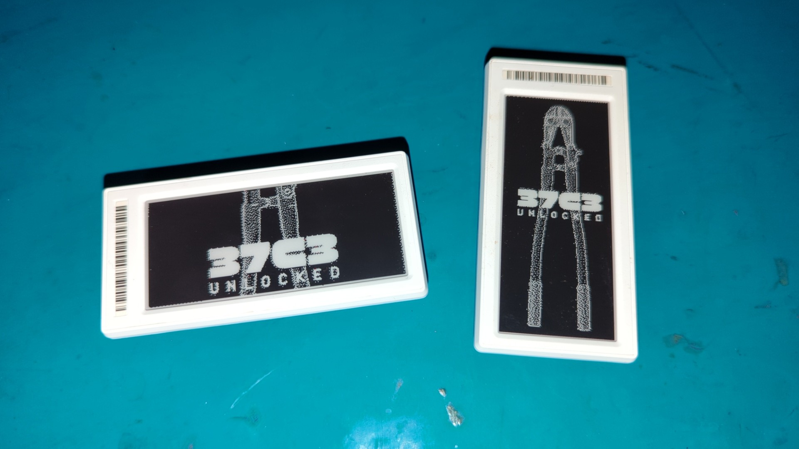

+++
title = 'ChaosZone goes 37c3 ~ Kombinate aller Länder vereinigt euch! ~'
date = 2023-12-19T22:39:26+02:00
+++

## ostdeutsch
Genossinnen und Genossen! 
Wir machen uns auf ins kapitalistische Ausland, um dort an der diesjährigen [Messe](https://events.ccc.de/category/37c3/) für Rechentechnik und Signalverarbeitung teilzunehmen.
Unsere Schwestern und Brüder im elektronischen Geiste aus Hamburg heißen uns Willkommen. Uns soll Platz zugewießen werden, so sagt man, mit Tischen und Stühlen bestückt. Eine Ecke zum Werken und Wirken soll es auch geben.
Desweiteren werden, mit etwas Glück, Eisbowlen gereicht und neumodische Anstecknadeln produziert. 
Kommen Sie, schauen Sie und sprechen Sie uns an! Wir werden Sie gerne in die sozialistische Arbeit einführen.
Nach Ankunft werden wir ein Signal über [Sputnik42](https://chaos.social/@chaoszone) absenden, somit Sie uns finden können.
Solidarische Grüße,
Nerdschaft!

## deutsch
Einige Wesen der Chaoszone werden am diesjährigen [Congress](https://events.ccc.de/category/37c3/) des Chaos Computer Clubs in Hamburg teilnehmen.
Wir werden dort eine Assemblyfläche mit ein paar Tischen, Stühlen und einer kleinen Workshopecke haben! :)
Wenn alles klappt werden wir auch eine Slushimaschine und eine Buttonmaschine dahaben und Live Slushis und Buttons machen. ^^
Komm gerne vorbei! Eine genauere Ortsangabe wird später via [Mastodon](https://chaos.social/@chaoszone) bekannt gegeben.

## english
Some Chaoszone creatures will be attending this year's Chaos Computer Club [Congress](https://events.ccc.de/category/37c3/) in Hamburg.
We will have an assembly area with a few tables, chairs and a small workshop corner! :)
If everything works out well we will also have a slushi machine and a button machine there and make live slushis and buttons. ^^
Feel free to come by! A more exact location will be announced later via [Mastodon](https://chaos.social/@chaoszone).

## česky
Některé z bytostí Chaoszone se zúčastní letošního [kongresu](https://events.ccc.de/category/37c3/) Chaos Computer Clubu v Hamburgu.
Budeme tam mít prostor s několika stoly, židlemi a malým workshopovým koutkem! :)
Pokud vše vyjde, budeme tam mít také stroj na slushie, stroj na placky a budeme vyrábět živě slushie a placky. ^^
Neváhejte a přijďte! Přesnější místo oznámíme později prostřednictvím [Mastodonu](https://chaos.social/@chaoszone).