+++
title = '39c3 Diary Entries'
date = 2026-01-01T22:39:26+02:00
+++

## October 30, 2025

We’re meeting for our first official planning session of the year via Jitsi Meet.
We’re brainstorming ideas: 
We plan to make buttons, 
rebuild the pixel flood and flipdot displays, 
and set up an info table for the data tracks and the ChaosZone in general.
PCBs, OpenLED race, decorative projector, arcade machine with Polyplay games,
Hugo phone game,...

Don’t forget the district signs!
Get more people from the ChaosZone involved in organizational tasks!

## November 6, 2025

Second meeting. The first rounds of vouchers are done.
Assemblies are slowly being set up and a list of participants has been started.
We’re asking Møbelhaus for sofas. We’d like an extra info table.
And we’ve decided to use the red umbrellas as decorations again.

## November 13, 2025

Only a few people in the org Jitsi.
We go over a few points from the last meeting.

## November 20, 2025

Unfortunately, we can’t get any sofas from the furniture store,
but we want shelves for extra swap space. An email goes out to the LOC.

## November 27, 2025

Potsdam is offering lighting. We’re excited. :)
Umbrellas have been located and pickup scheduled.
New ChaosZones T-shirt designs are emerging. An order list is being started.
We’re planning a balloon arch.
Sofas maybe from Leipzig?

## December 04, 2025

Participation: low
No sofas from Leipzig after all, and LOC says no to shelves.
But a new shelf option pops up.

## December 18, 2025

Our big ChaosZones sign is being brought from Chemnitz by the folks from Zwickau.
We’re thinking about setting up a fax machine and are supposed to get a blackboard.

---

## Day 0
The participants are slowly making their way here.
Umbrellas are being collected, things are being transported, and everything that’s already here is being set up.

<section class="container image-gallery">
    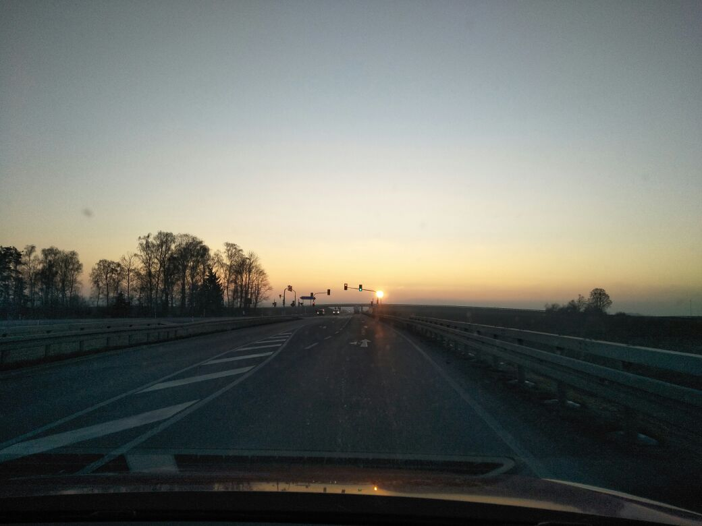
</section>

## Day 1
Almost all the creatures are here now, and it’s a real buzz at our tables. :)
Highlight: Some of us are up on stage in Hall 1, 
during the Digital Independence Day presentation. :D

<section class="container image-gallery">
    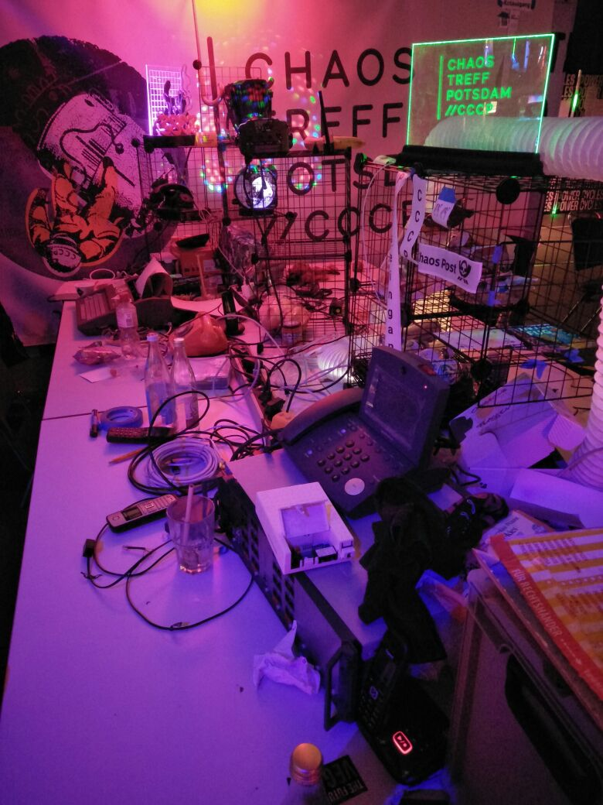
    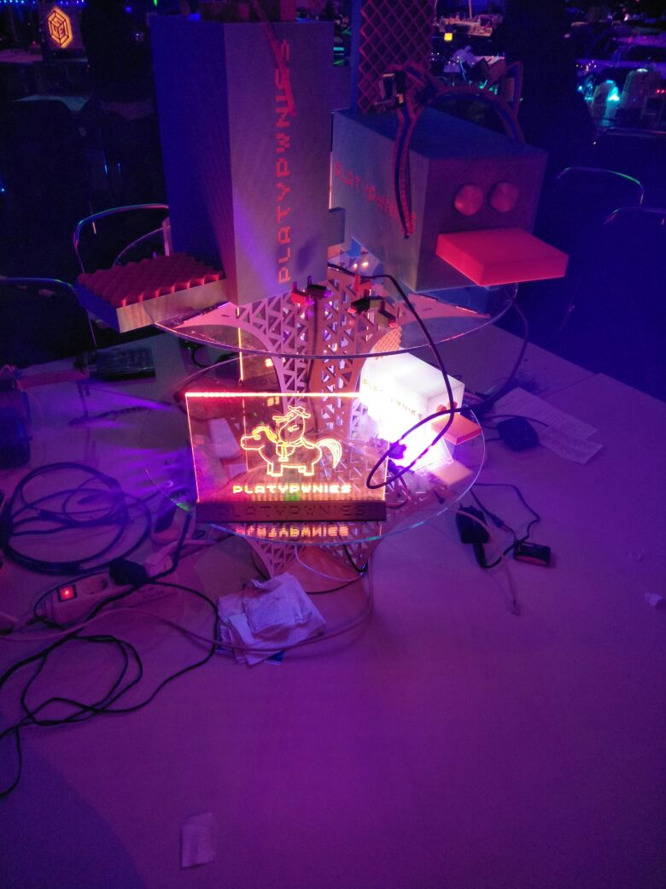
    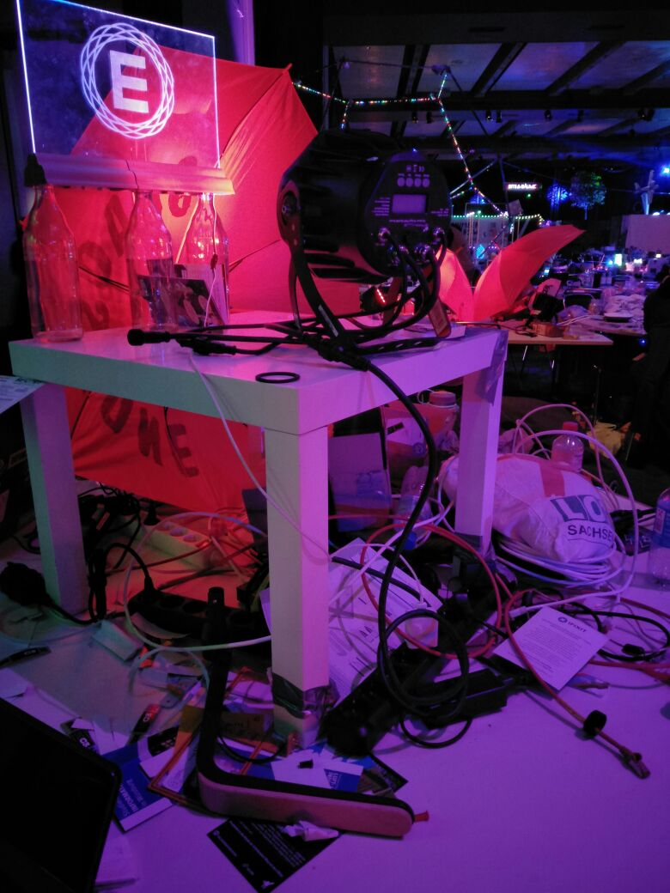
    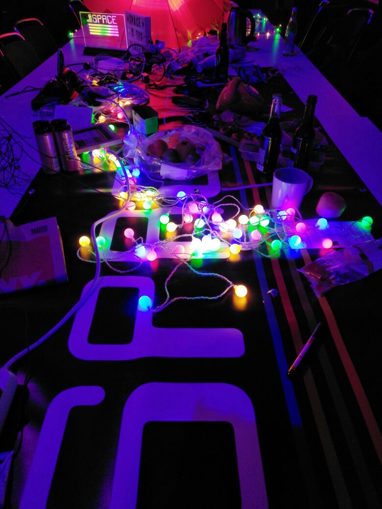
    
    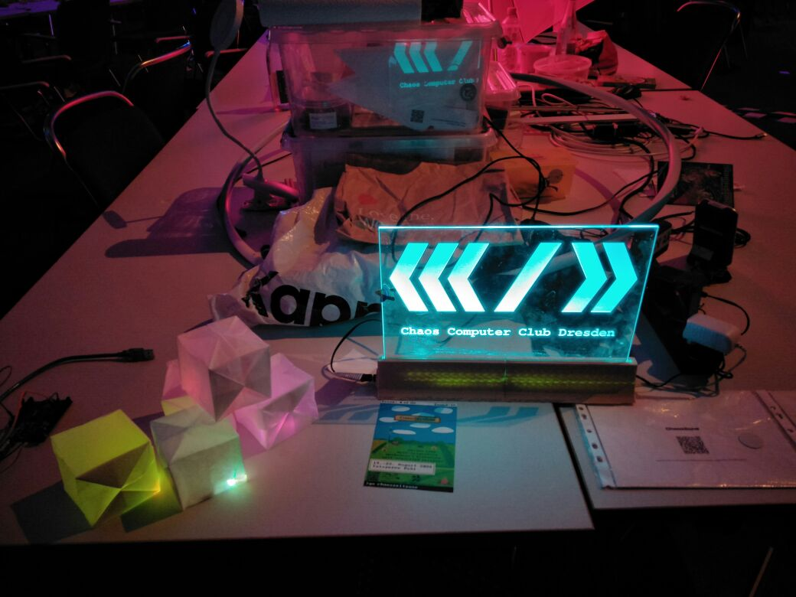
    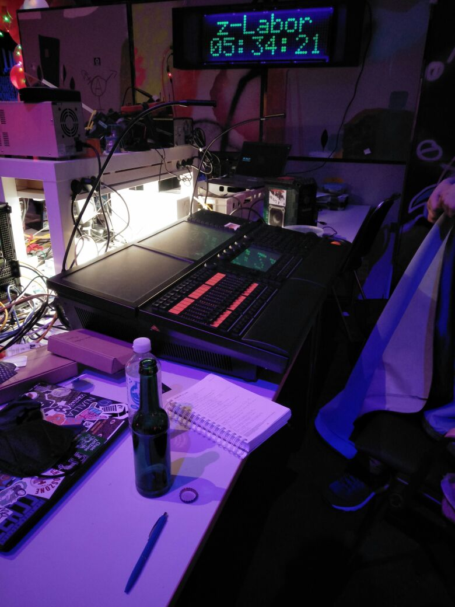
</section>

## Day 2
Pixelflut is in full swing. Button production has started. 
Flyers for our camping area—ChaosZeltZone—have been prepared.

<section class="container image-gallery">
    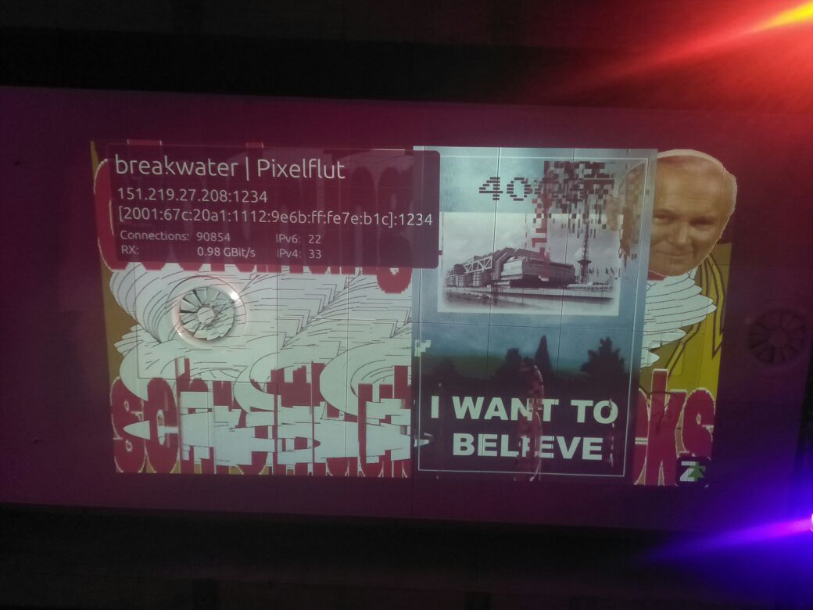
    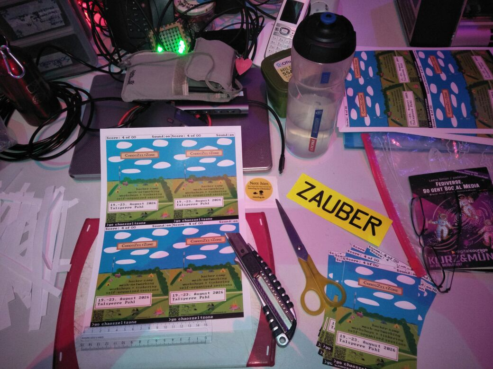
    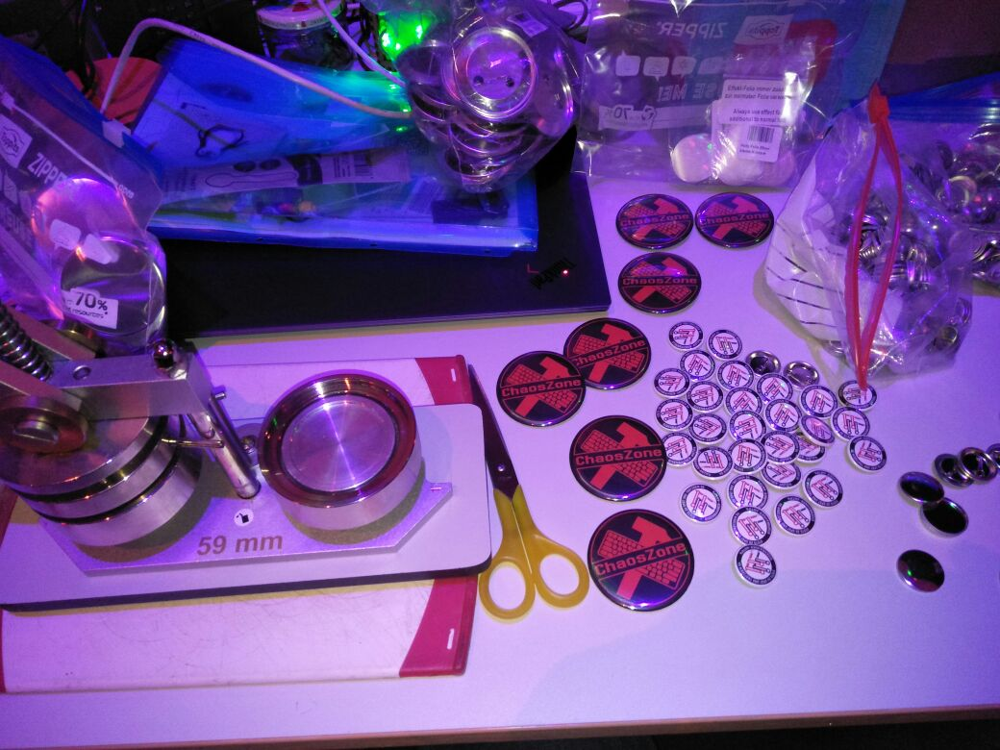
</section>

## Day 3
Probably the busiest day of them all. :)
Everyone is doing everything somehow! :D
Including a punk rock party in the Engelküche. <3

<section class="container image-gallery">
    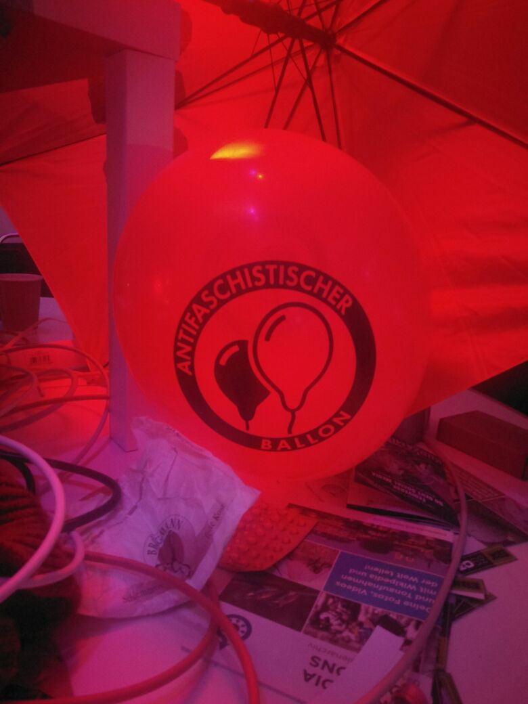
    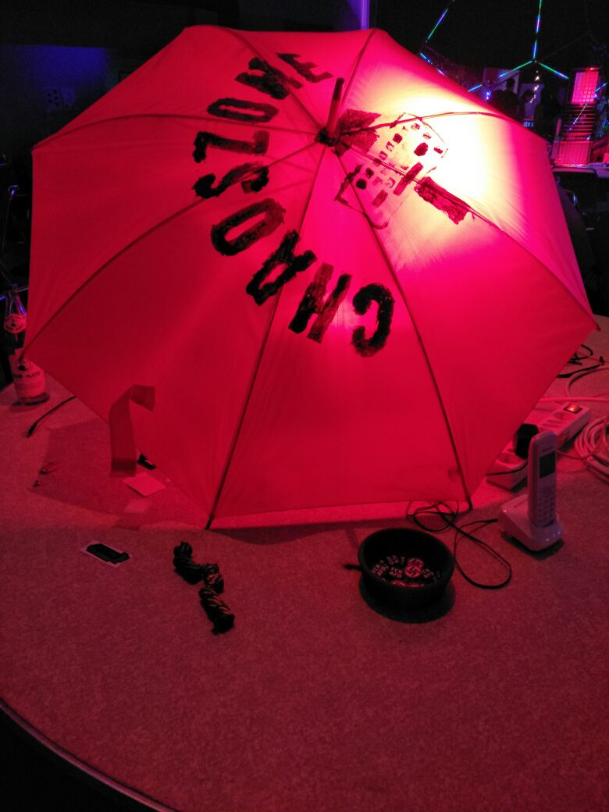
    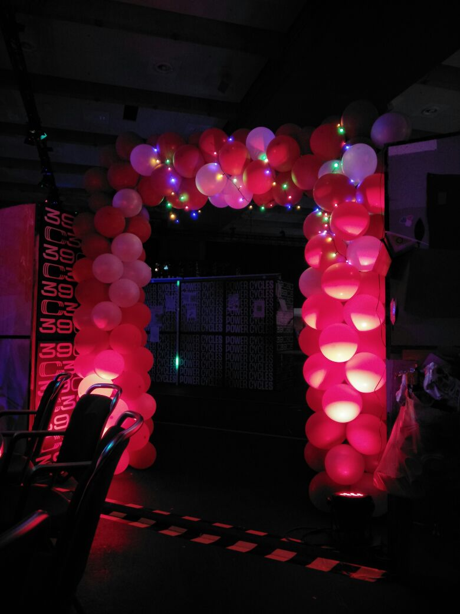
    
    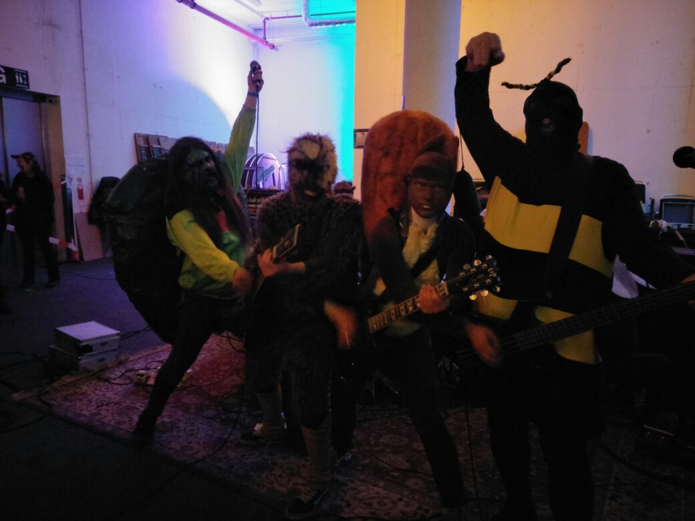
</section>

## Day 4
The hustle and bustle is slowly winding down, but many are still here helping with the takedown.
I look into many happy but also somewhat overtired faces. ;)
#exhaustedbutsmiling

---

## Debrief

The umbrellas and lighting worked great.
Space allocation wasn’t ideal because some spots were double-booked.
Still loving the idea of a sofa corner.
If there’s room, we’d love to set up a mini workshop area.

See you next year!... or at one of our smaller events.
